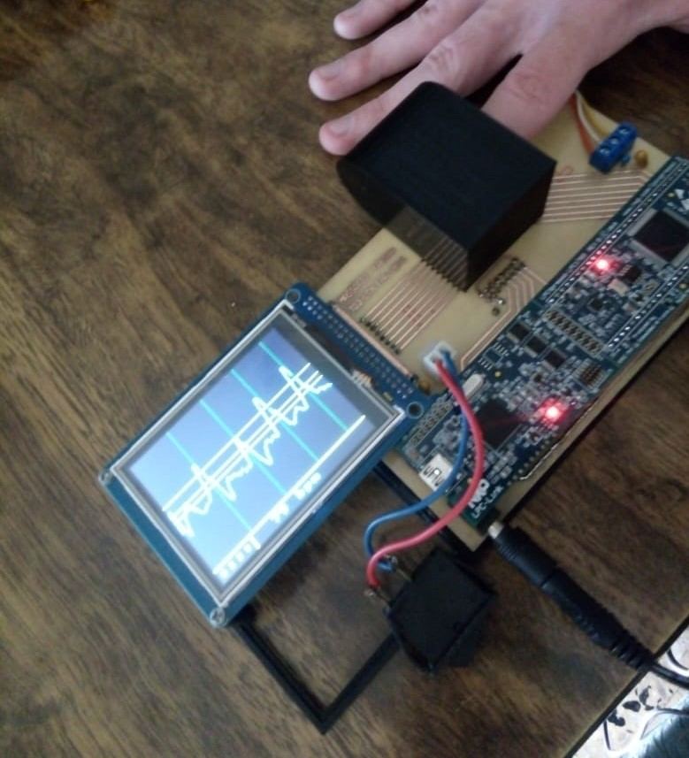
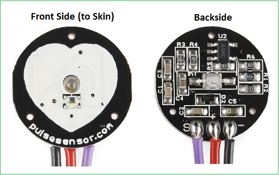
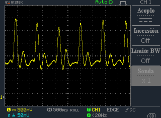
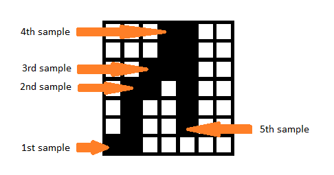
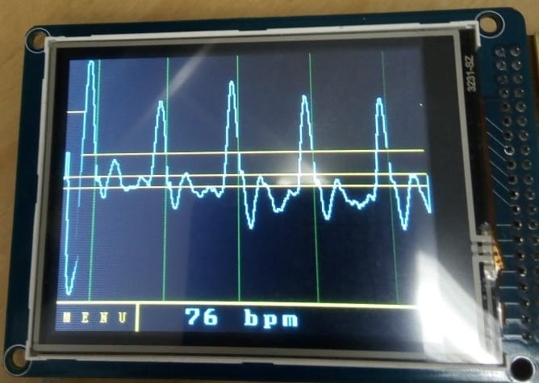
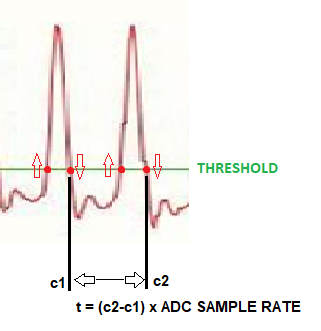

# ecg-analyzer
The project consists of the development of a device capable of non-invasively detecting blood flow in order to graph the measured signal in real time and calculate the heart rate.

Processing is done with a Cortex-M3 LPC1769 microcontroller, leveraging FreeRTOS operating system.

## Signal acquisition

The pulse sensor works by measuring the variation of light reflected off the skin tissue due to the pumped blood.

## Signal drawing

For this we use a 320x240 pixels TFT display. Each column on the screen represents a sample. In order to shape the signal, the microcontroller plots a vertical line from the pixel corresponding to the value of the previous sample to the pixel that represents the value of the current sample. That is, the waveform is achieved by a succession of vertical bars.

## BPM Calculation

In order to detect a heart beat, the sample value is compared against a given threshold. For the pulse to be valid, the signal must cross the threshold level twice, one upward and one downward. When this second crossing occurs, the program saves in an array the column number of the screen for which it occurred, which is an equivalent of the instant in time.

Once the signal reaches the end of the screen, all the columns in which a pulse occurred are stored in the array. As each column represents a sample taken by the ADC, to know the time interval between two pulsations, it is enough to multiply their separation by the sampling rate.

The heart rate calculation is performed each time the signal has finished scrolling the screen. We simply calculate an average of all the intervals between beats and then find the number of beats per minute by direct proportion.

https://user-images.githubusercontent.com/62024284/130856245-f347c0ca-c484-41f0-9285-f52bd38905af.mp4
